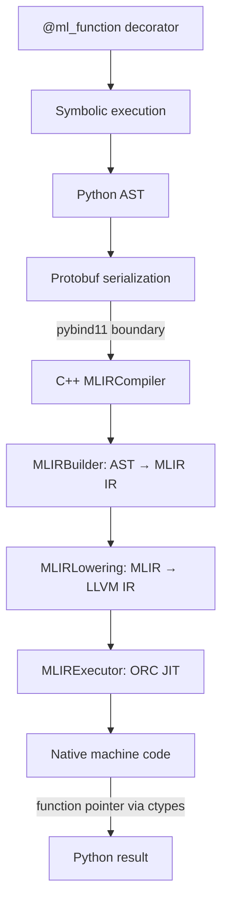
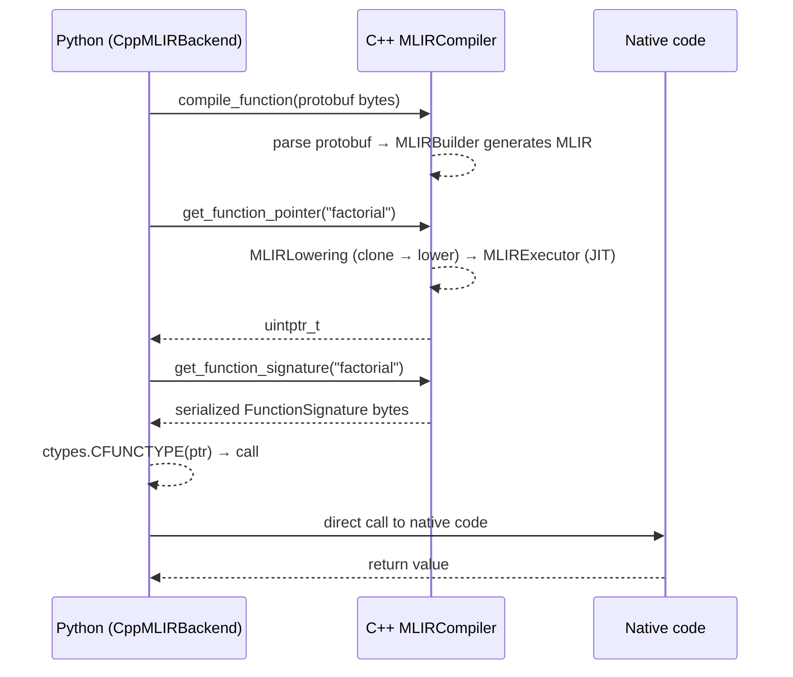

# Architecture

This project is an MLIR-based Embedded Domain-Specific Language (EDSL) for Machine Learning. Users write functions in Python using a restricted set of operations, and the system compiles them through MLIR down to native machine code via LLVM JIT. The Python frontend builds an AST through symbolic execution, serializes it to protobuf, and sends it across a pybind11 boundary to a C++ backend that generates MLIR IR, lowers it to LLVM IR, and JIT-compiles it for execution.

## Compilation Pipeline



The pipeline has two phases. The **definition phase** happens at decoration time: the decorator runs the function body with symbolic `Parameter` objects to build an AST and validate types. The **execution phase** happens on first call: the AST is serialized, compiled through MLIR/LLVM, and JIT-compiled. Subsequent calls reuse the compiled native code.

## Directory Structure

```
mlir_edsl/                          # Python frontend
    __init__.py                     # Public API exports
    types.py                        # Type system (ScalarType, ArrayType)
    backend.py                      # C++ backend wrapper, ctypes execution
    ast_pb2.py                      # Generated protobuf Python code
    ast/                            # AST node implementations
        base.py                     # Value base class
        operators.py                # Operator overloads (__add__, __le__, etc.)
        serialization.py            # Protobuf serialization context (SSA reuse)
        helpers.py                  # JAX-style .at[] array indexing
        nodes/
            scalars.py              # Constant, BinaryOp, CompareOp, CastOp
            arrays.py               # ArrayLiteral, ArrayAccess, ArrayStore, ArrayBinaryOp
            control_flow.py         # IfOp, ForLoopOp
            functions.py            # Parameter, CallOp
    ops/                            # User-facing operation builders
        arithmetic.py               # add, sub, mul, div
        comparison.py               # lt, le, gt, ge, eq, ne
        control_flow.py             # If, For
        conversion.py               # cast, call
    functions/                      # Function decoration and compilation
        decorator.py                # @ml_function → MLFunction wrapper
        signature.py                # Type hint extraction
        validation.py               # Symbolic execution and type checking
        compilation.py              # AST → backend compilation
        context.py                  # Symbolic execution context manager

cpp/                                # C++ backend
    schemas/
        ast.proto                   # Protobuf schema (single source of truth for types)
    include/mlir_edsl/
        MLIRCompiler.h              # Unified facade (owns context, module, orchestrates all)
        MLIRBuilder.h               # AST → MLIR IR generation (non-owning)
        ArithBuilder.h              # arith dialect operations
        SCFBuilder.h                # scf dialect (if, for)
        MemRefBuilder.h             # memref dialect (arrays)
        TensorBuilder.h             # tensor dialect operations
        MLIRLowering.h              # MLIR → LLVM IR lowering
        MLIRExecutor.h              # LLVM ORC JIT engine
    src/
        MLIRCompiler.cpp            # Facade: compilation, finalization, state management
        MLIRBuilder.cpp             # Core IR generation
        MLIRExecutor.cpp            # JIT compilation and execution
        MLIRLowering.cpp            # Lowering passes
        python_bindings.cpp         # pybind11 glue (only exposes MLIRCompiler)
        builders/
            ArithBuilder.cpp        # arith.addi, arith.muli, arith.sitofp, etc.
            SCFBuilder.cpp          # scf.if, scf.for
            MemRefBuilder.cpp       # memref.alloca, memref.load, memref.store
            TensorBuilder.cpp       # tensor dialect operations

tests/                              # pytest suite
```

## Walkthrough: Factorial

Here is a concrete example traced through every stage.

### 1. User code

```python
from mlir_edsl import ml_function, mul, sub, eq, If, call, i32

@ml_function
def factorial(n: int) -> int:
    return If(eq(n, 0),
              1,
              mul(n, call("factorial", [sub(n, 1)], i32)))

result = factorial(5)  # returns 120
```

### 2. Decoration: symbolic execution

When `@ml_function` is applied, `MLFunction.__init__` runs the function body with a symbolic `Parameter("n", i32)` object instead of a real integer. Every operation (`eq`, `sub`, `mul`, `If`, `call`) detects it is inside a `symbolic_execution()` context and returns an AST node instead of computing a value. The result is a tree:

```
IfOp
├── condition: CompareOp(EQ, Parameter("n"), Constant(0))
├── then: Constant(1)
└── else: BinaryOp(MUL,
               Parameter("n"),
               CallOp("factorial", [BinaryOp(SUB, Parameter("n"), Constant(1))]))
```

Type inference runs on this tree to verify the return type matches the declared `-> int`.

### 3. First call: protobuf serialization

On the first call to `factorial(5)`, the cached AST is serialized to protobuf via `to_proto_with_reuse()`. The `SerializationContext` detects that `Parameter("n")` appears multiple times in the tree and emits a `LetBinding`/`ValueReference` pair so the C++ side can generate proper SSA form. The serialized `FunctionDef` protobuf is sent across the pybind11 boundary as raw bytes.

### 4. C++ MLIR generation

`MLIRCompiler::compileFunction` receives the parsed `FunctionDef` protobuf, creates the function shell (entry block, parameter mapping), then delegates to `MLIRBuilder::buildFromProtobufNode` which dispatches each AST node to a category handler:

| AST category | Handler | MLIR dialect |
|---|---|---|
| `ScalarNode` | `buildFromScalarNode()` | `arith` (constants, binary ops, casts) |
| `ArrayNode` | `buildFromArrayNode()` | `memref` (alloca, load, store) |
| `ControlFlowNode` | `buildFromControlFlowNode()` | `scf` (if, for) |
| `FunctionNode` | `buildFromFunctionNode()` | `func` (parameters, calls) |
| `BindingNode` | `buildFromBindingNode()` | SSA value reuse (let/ref) |

Each handler delegates to a specialized dialect builder (`ArithBuilder`, `SCFBuilder`, `MemRefBuilder`, `TensorBuilder`) that creates MLIR operations. The factorial example produces IR like:

```mlir
module {
  func.func @factorial(%arg0: i32) -> i32 {
    %c0_i32 = arith.constant 0 : i32
    %0 = arith.cmpi eq, %arg0, %c0_i32 : i32
    %1 = scf.if %0 -> i32 {
      %c1_i32 = arith.constant 1 : i32
      scf.yield %c1_i32 : i32
    } else {
      %c1_i32 = arith.constant 1 : i32
      %2 = arith.subi %arg0, %c1_i32 : i32
      %3 = func.call @factorial(%2) : (i32) -> i32
      %4 = arith.muli %arg0, %3 : i32
      scf.yield %4 : i32
    }
    return %1 : i32
  }
}
```

### 5. Lowering and JIT

On first call to `getFunctionPointer`, `MLIRCompiler::ensureFinalized` triggers the lowering and JIT pipeline:

1. **MLIRLowering** clones the module (`OwningOpRef` for RAII cleanup) and runs conversion passes: `OneShotBufferize` (tensor→memref), `SCFToControlFlow`, `ArithToLLVM`, `MemRefToLLVM`, `ControlFlowToLLVM`, `FuncToLLVM`, and `ReconcileUnrealizedCasts`. The result is an `llvm::Module` + `llvm::LLVMContext` pair.
2. **MLIRExecutor** takes ownership of both via `std::move`, runs LLVM optimization passes (Mem2Reg, InstCombine, SimplifyCFG, optionally GVN), wraps them in a `ThreadSafeModule`, and hands them to ORC LLJIT. Symbol lookup caches native function pointers.

The original MLIR module is preserved — adding functions after finalization auto-invalidates the JIT, and re-finalization re-lowers the entire module.

### 6. Execution

`CppMLIRBackend.execute_function` retrieves the function pointer, wraps it with `ctypes.CFUNCTYPE` using the registered signature (mapping `i32 → ctypes.c_int32`), and calls it with the Python arguments. The native return value is marshalled back to a Python `int`.

## Python/C++ Boundary

Python talks to a single `MLIRCompiler` facade via pybind11. IR never crosses the boundary — only serialized protobuf bytes and integer function pointers:



- **Serialization format**: Protobuf (`FunctionDef.SerializeToString()` / `ParseFromString()`)
- **Execution format**: Function pointers returned as `uintptr_t`, called via `ctypes.CFUNCTYPE` (bypasses pybind11)
- **Schema**: `cpp/schemas/ast.proto` is the single source of truth for AST node types, operation enums, and type definitions

## Type System

All types inherit from the abstract `Type` base class:

```
Type (ABC)
├── ScalarType
│   ├── i32   (32-bit signed integer, Python int)
│   ├── f32   (32-bit float, Python float)
│   └── i1    (boolean, Python bool)
└── ArrayType
    ├── Array[4, i32]         (1D: memref<4xi32>)
    ├── Array[2, 3, f32]      (2D: memref<2x3xf32>)
    └── Array[2, 3, 4, i32]   (3D: memref<2x3x4xi32>)
```

Key rules:
- **No implicit type promotion.** `add(i32_val, f32_val)` is a type error. Use `cast()` explicitly.
- **Type errors are caught at decoration time**, not at runtime, via symbolic execution.
- **Python type hints map to MLIR types**: `int → i32`, `float → f32`, `bool → i1`.
- **Arrays cannot be cast.** Only scalar-to-scalar casts are allowed.

## MLIR Dialects Used

| Dialect | Purpose | Key operations |
|---|---|---|
| `arith` | Arithmetic and comparisons | `addi`, `muli`, `subi`, `divsi`, `cmpi`, `sitofp`, `fptosi` |
| `func` | Function definitions and calls | `func.func`, `func.call`, `return` |
| `scf` | Structured control flow | `scf.if`, `scf.for`, `scf.yield` |
| `memref` | Fixed-size arrays | `memref.alloca`, `memref.load`, `memref.store` |
| `tensor` | Value-semantic tensors | `tensor.empty`, `tensor.insert`, `tensor.extract` |
| `bufferization` | Tensor → memref conversion | `one-shot-bufferize` pass |
| `cf` | Control flow (branching) | Used during lowering (SCF → cf.br/cf.cond_br) |
| `llvm` | LLVM dialect | Target of all lowering passes |

## C++ Ownership Model

`MLIRCompiler` is the sole owner of all C++ state. It is non-copyable and non-movable due to raw-pointer aliasing between members. Declaration order in the header enforces safe destruction (C++ destroys members in reverse order):

```
MLIRCompiler owns:
│
├── 1. Infrastructure (destroyed last)
│   ├── unique_ptr<MLIRContext>          ← dialect registry, type uniquing
│   ├── unique_ptr<OpBuilder>            ← creates MLIR ops
│   └── OwningOpRef<ModuleOp>            ← top-level module (all func ops)
│
├── 2. Shared state (destroyed middle)
│   ├── parameterMap                     ← current function's arg name → mlir::Value
│   ├── functionTable                    ← all function name → FuncOp
│   ├── compiledFunctions                ← set of compiled names
│   └── signatures                       ← serialized FunctionSignature per function
│
└── 3. Components (destroyed first)
    ├── unique_ptr<MLIRBuilder>          ← borrows context*, builder*, parameterMap*, functionTable*
    │   └── owns: valueCache, dialect builders (Arith, SCF, MemRef, Tensor)
    └── unique_ptr<MLIRExecutor>         ← owns LLJIT, function pointer cache
```

Key ownership transfers during finalization:
- `MLIRLowering` is stack-local, clones the module into an `OwningOpRef` (RAII cleanup), and produces an `llvm::Module` + `llvm::LLVMContext`
- Both are `std::move`d into `MLIRExecutor::compileModule`, which wraps them in a `ThreadSafeModule` and hands them to ORC LLJIT
- After JIT compilation, ORC owns the LLVM module; the executor only caches native function pointer addresses

## Related Documents

- **[ROADMAP.md](ROADMAP.md)** — Implementation phases, current status, and future plans
- **[BUILD.md](BUILD.md)** — Build instructions and dependencies
- **[tests/CLAUDE.md](tests/CLAUDE.md)** — Test conventions and patterns
